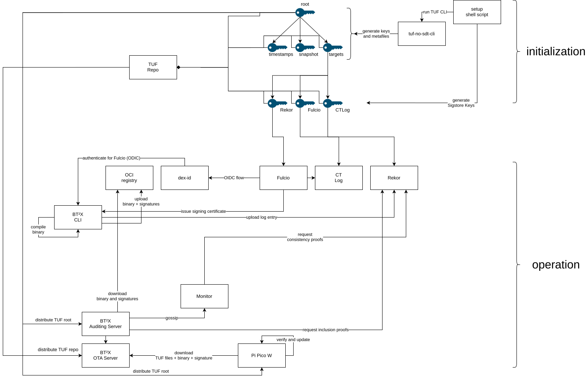
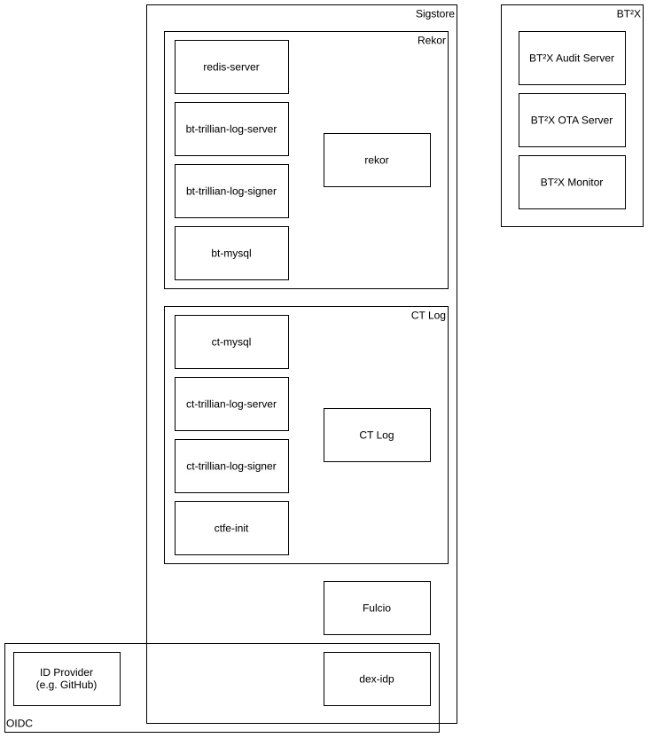
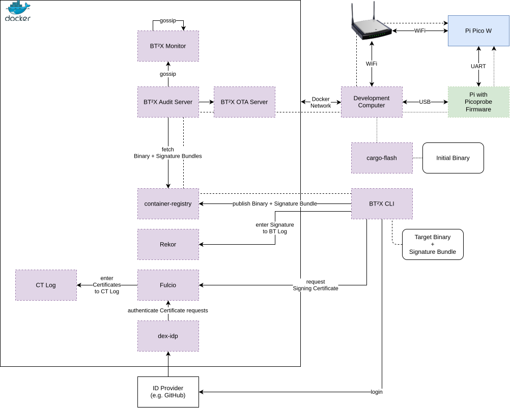

# BT²X

Multi-Leveled Binary Transparency to Protect the Software Supply Chain of Operational Technology.

**The code in this repository is experimental and not to be used in production.**

**This project is not maintained. It has been published as part of the scientific paper specified in the next section.**

## BibTeX Citation

If you use BT²X in a scientific publication, we would appreciate using the following citation:

```
@inproceedings{10.1145/3690134.3694816,
author = {Heinl, Michael P. and Embacher, Victor},
title = {BT²X: Multi-Leveled Binary Transparency to Protect the Software Supply Chain of Operational Technology},
year = {2024},
publisher = {Association for Computing Machinery},
address = {New York, NY, USA},
url = {https://doi.org/10.1145/3690134.3694816},
doi = {10.1145/3690134.3694816},
booktitle = {Proceedings of the Sixth Workshop on CPS&IoT Security and Privacy (CPSIoTSec’24)},
keywords = {digital certificates, X.509, ASN.1, parsing, TLS libraries, conformity testing},
location = {Salt Lake City, UT, USA},
series = {CPSIoTSec’24}
}

```

## License

This project is distributed under the Apache-2.0 License, see [LICENSE.txt](LICENSE.txt) for details.

## Project Structure

This repository contains a lot of code, however, it is separated into modules at a best-effort basis to improve understandability. **This readme aims to provide a high-level entry point to the project, the subdirectories and libraries have their own documentation as well.**

We have the following major components:
- The `bt2x` directory contains most of the modules related to the binary transparency functionality.
- The `tuf-no-std` directory contains a `no-std` Rust implementation of [TUF](https://theupdateframework.io/) based on the [DER format](https://en.wikipedia.org/wiki/X.690#DER_encoding).
- The `bt2x-pi-pico-w` directory contains the code for a dummy application with an OTA updater as well as the binaries that were used for benchmarking.
- The `bt2x-embassy-std` directory contains code that can be used to run the embedded code (which mostly depends on [embassy](https://embassy.dev/) and other embedded libraries) on a regular host.
- The `benchmarking` directory contains the code to analyze the benchmark data as well as the code to gather/process the data.
- The `configs` directory contains configuration files that are used for the docker setup and also serve as an example on how to configure the applications.

## Documentation

This README is not the only place of documentation.
Some of the subdirectories have their own READMEs.
Additionally, there is additional documentation added to the Rust code via `rustdoc`,
which you can build and browse by running the following shell script.

```sh
./build-docs.sh
```

## General Operation

The following figure shows how the architecture roughly works.



## Docker Setup

The docker setup includes the Sigstore components as well as the BT²X components.
There is some redundancy in the components, as both Rekor and the CT log are implemented as Trillian *personalities*. Trillian itself is run as two containers and an SQL server.

Additionally, in our example, the OIDC provider `dex-idp` is reliant on an external ID provider (e.g., the GitHub OAuth 2.0 provider). 

The following figure shows which containers belong to what system.




## Getting Started

### Development Setup

This following figure shows how different hardware components interact with each other/how they are "wired", and how binaries flow through the system.



### Dependencies

- Install the Rust toolchain via [rustup](https://rustup.rs/).
- Make sure you have OpenSSL installed.
- [This guide](https://reltech.substack.com/p/getting-started-with-rust-on-a-raspberry) is helpful to set up the dependencies for the Pico W development setup. 

### Initial Setup

1. Run the `setup.sh` script to generate the keys and TUF repo. This might take a while in cases where everything needs to be compiled.
2. [Create a GitHub OAuth app](https://docs.github.com/en/apps/oauth-apps/building-oauth-apps/creating-an-oauth-app) with the URL `http://dex-idp/` and the authorization callback URL `http://dex-idp:8888/callback`
3. Create a `.env` file in the root directory with the following variables:
```env
MYSQL_ROOT_PASSWORD=zaphod
MYSQL_USER=test
MYSQL_PASSWORD=zaphod
KEYCLOAK_ADMIN_PASSWORD=admin
GITHUB_CLIENT_ID=<ENTER CORRECT ID>
GITHUB_CLIENT_SECRET=<ENTER CORRECT SECRET>
PRIV_KEY_PASSWORD=sigstore
```
4. You need to modify `configs/bt2x-server/config.yaml` and add the correct e-Mail address

### Starting the Infrastructure

Start the infrastructure with the following command. **Note:** this starts a relatively large number of docker contains and requires some resources. Also building the containers can take a while.

```sh
docker compose -f=docker-compose.sigstore.yml -f=docker-compose.bt2x.yml up -d
```

You can remove the containers with the following command:

```sh
docker compose -f=docker-compose.sigstore.yml -f=docker-compose.bt2x.yml down
```

### Uploading a Signed Binary to the Infrastructure

1. In the `bt2x` directory, run the command to build the CLI binary:
```sh
cargo build --release --bin=bt2x-cli
``` 
2. In the `bt2x-pi-pico-w` directory, run the following command:
 ```sh
../bt2x/target/release/bt2x-cli --tag=localhost:1338/bt2x/pi-pico:bin --http --rekor-url=http://localhost:3000 --rekor-public-key=../sigstore/rekor/rekor_key.pem --fulcio-url=http://localhost:5555 --fulcio-public-key=../sigstore/configs/fulcio/config/fulcio.pem --bin=blinky --target=thumbv6m-none-eabi --log-level=debug --ct-log-public-key=../configs/sigstore/fulcio/ctfe-init/config/pubkey.pem --oidc-issuer=http://dex-idp:8888/
```

### Building/Flashing the Pico W Binaries


## Troubleshooting

### Something is complaining about Rekor have a log index of 0

Cause: this can happen if the log is empty or you are trying to run operations on an item with the log index of 0.

Fix it by running:
- `docker compose -f=docker-compose.sigstore.yml -f=docker-compose.bt4ot.yml up populate-rekor -d`
- or by running the publishing CLI tool again.

## "Error entering certificate in CTL"

You might get this error when using the CLI tool. You can fix it by removing the `ctfe-config` docker volume and restarting the setup. 
